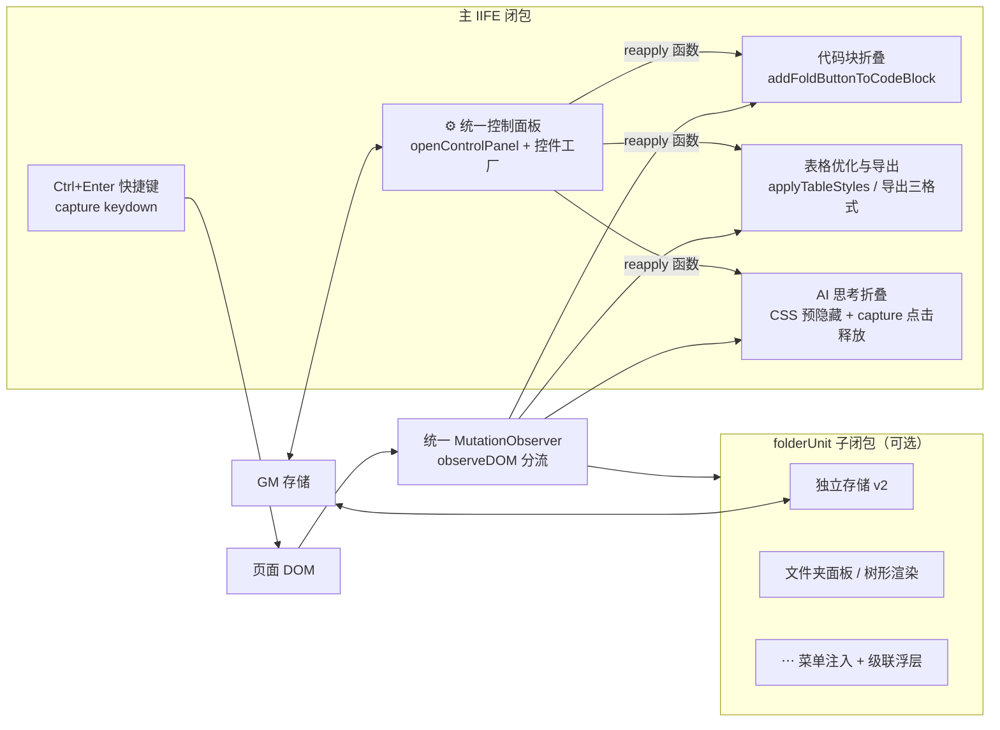
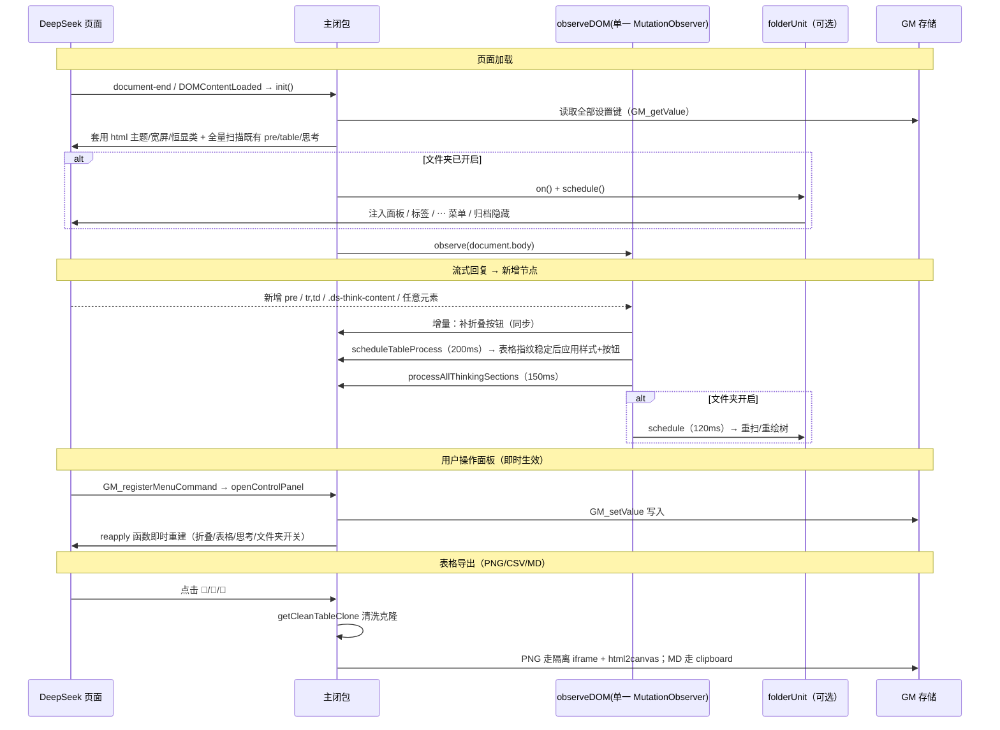

# DeepSeek 功能增强工具箱 — 代码地图（MAP）

> 依据 `deepseektool.user.js`（@version 4.7.0）实际代码整理，描述模块划分、数据流与运行时调度。

## 1. 载体与元信息（头部注释）

| 项 | 值 | 说明 |
| --- | --- | --- |
| 运行载体 | Tampermonkey / ScriptCat userscript | 单 IIFE 主闭包 + `folderUnit` 子闭包 |
| `@match` | `chat.deepseek.com` / `www.deepseek.com` / `deepseek.com` | 仅 DeepSeek Web 注入 |
| `@run-at` | `document-end` | 见第 4 节：`readyState==='loading'` 挂 DOMContentLoaded，否则立即 `init()` |
| `@grant` | `GM_addStyle` / `GM_getValue` / `GM_setValue` / `GM_registerMenuCommand` | 无网络、无跨域 GM_xhr |
| `@require` | `html2canvas@1.4.1` | 仅 PNG 导出使用（启动不加载逻辑依赖） |
| 状态载体 | `GM_getValue`/`GM_setValue`（每次写入即时持久化） | 设置与文件夹数据分离两键 |

## 2. 状态与存储（GM_* 键 → 全局变量镜像）

> 模式：读取时 `let x = GM_getValue(KEY, 默认)` 建内存镜像；面板/开关改动时先写变量 → `GM_setValue` → 调即时重应用函数。

| 存储键 | 变量 | 默认 | 用途 / 面板控件 |
| --- | --- | --- | --- |
| `deepseek_fold_threshold` | `foldThreshold` | 20 | 代码块自动折叠阈值（0 禁用） |
| `deepseek_fold_preview_lines` | `previewLines` / `enablePreviewLines` | 0 | 折叠后保留预览行数 |
| `deepseek_table_buttons_enabled` | `tableButtonsEnabled` | true | 是否注入表格导出按钮 |
| `deepseek_table_buttons_always` | `tableButtonsAlways` | false | 导出按钮恒显（`html.ds-export-always`） |
| `deepseek_auto_collapse_thinking` | `autoCollapseThinking` | true | AI「已思考」自动折叠总开关 |
| `deepseek_simulate_click_thinking` | `simulateClickThinking` | true | 模拟点击 vs CSS 直接折叠 |
| `deepseek_table_theme_mode` | `tableThemeMode` | 'auto' | 表格配色：auto / dual |
| `deepseek_table_width_mode` | `tableWidthMode` | 'equal' | 列宽：equal / auto / equal-minwidth |
| `deepseek_wide_screen` | `wideScreen` | false | 宽屏模式（`--message-list-max-width:1000px`） |
| `deepseek_ctrl_enter` | `ctrlEnterEnabled` | false | Ctrl+Enter 发送快捷键 |
| `deepseek_folder_manager_enabled` | `folderManagerEnabled` | false | 对话文件夹总开关（opt-in） |
| `deepseek_folder_manager_data_v2` | `data`（folderUnit 内） | `{folders:[],links:{},expanded:{},collapsed:false}` | 文件夹/归属/树展开态/面板折叠态（独立键） |

## 3. 模块总览

## 4. 初始化与统一 DOM 监听

### 4.1 `init()` 执行序列（幂等，仅一次）

1. 套用静态开关：`applyTableThemeClass` / `applyWideScreen` / `setTableButtonsAlways`（写 `html` 类）。
2. 代码块：`cleanupLegacyWrappers()`（清旧 wrapper）→ `deduplicateButtons()` → `processAllExistingCodeBlocks()` 全量补折叠按钮。
3. 表格：`processAllTables()` 全量处理既有表格。
4. 思考：若开启 → `setupThinkContentHiding()`（注入预隐藏 style + 注册 capture click）+ `processAllThinkingSections()`。
5. 文件夹：若开启 → `folderUnit.on()` + `folderUnit.schedule()`（不等首轮 DOM 变化）。
6. `observeDOM()`：注册 body 级 MutationObserver。
7. `resize` 事件 → 100ms 节流 `processAllTables()`（配合表格 fixed 布局的视口宽联动）。

### 4.2 单一 MutationObserver 的分流（`observeDOM`）

对每次 `childList` mutation 的 `addedNodes` 做四路标记，互不串扰、增量处理：

| 信号 | 判定（matches/querySelector） | 处理 | 节流 / 防抖 |
| --- | --- | --- | --- |
| 代码块 | 新增 `pre` / 含 `pre` | 逐 `pre` `addFoldButtonToCodeBlock`（`data-fold-processed` 幂等） | 同步 |
| 表格 | 新增 `table,tbody,thead,tfoot,tr,td,th,.ds-markdown` | `scheduleTableProcess()` → `processAllTables` | 200ms 防抖 |
| 思考 | 新增 `.ds-think-content`（排除 `pre,.md-code-block` 内） | `processAllThinkingSections` | 150ms 延时 |
| 文件夹 | `folderManagerEnabled` 时任意 ELEMENT 新增（宽触发） | `folderUnit.schedule()` | 120ms 节流 |

防自循环：新增节点增量处理 + `data-*` 幂等标记；面板/标签自身的插入不会产生新的 childList 风暴（folder 注释：面板插入只多触发一次自稳 tick）。

## 5. 模块内部流程

### 5.1 代码块折叠

- **定位按钮容器** `findButtonContainer`：优先 `.code-info-button-text` → 兼容 `.ds-text-button` → 哈希容器兜底（选择器全面加固，不依赖哈希）。
- **自动折叠**：`foldThreshold>0 && 行数>阈值`。预览模式（`previewLines>0`）用 `maxHeight` 截断 + `.ds-fold-preview::after " ..."`；否则 `display:none`。
- **展开恢复**：记录 `origDisplay/origMaxHeight/origOverflow`，用户手动展开后不再被后续加载重置（`expandBlock`）。
- **重应用**：改阈值/预览行 → `reapplyFoldToAllCodeBlocks` 清标记重建按钮。

### 5.2 表格优化与导出

- **样式应用 `applyTableStyles`**：`maxWidth` 取自 `.ds-virtual-list-visible-items.clientWidth`；按 `tableWidthMode` 三策略（均分 / 内容比例自适应 / 均分+80px 下限，超出自动回落自适应并 Toast）；配色由 `html.ds-table-auto`（半透明叠加）或 `html.ds-table-dual`（浅/深双规则）类驱动；`overflow-wrap:anywhere`；仅改直接包裹的 `.ds-scroll-area`；完成后 `opacity:1` 淡入（消除闪烁）。
- **指纹稳定状态机**：`_tableFingerprints`（WeakMap）记录 `rows:cells`。首见立即应用；内容变化后重新进入稳定计数——连续 2 次指纹一致或 5s 超时后应用并 `done`，不再重复 reflow。
- **导出**：三格式共用 `getCleanTableClone`（深拷贝 + 清 fixed/宽度等内联样式 + 摘导出按钮/脚本标记）：
  - 📸 PNG：隔离 iframe（srcdoc + `collectTableStyles` 收集页面样式与兜底配色）→ `html2canvas scale:3` → blob 下载；
  - 📄 CSV：UTF-8 BOM + 引号/逗号/换行转义；
  - 📝 MD：复制到剪贴板；保留 `code`/`**`/`*` 行内语法、`|` 转义、` ` 折为空格。
- **显隐**：`.table-internal-buttons` 默认 hover 显示；`html.ds-export-always`（`setTableButtonsAlways`）强制常显。

### 5.3 AI 思考过程自动折叠

- **预隐藏（零布局偏移）**：注入 `#ds-think-hide`：`.ds-think-content{display:none!important}`；document **capture 阶段**监听折叠区点击 → 移除该 style → 官方正常创建可视内容。
- **折叠执行** `processAllThinkingSections`：基于稳定的 `.ds-think-content` 类名 + 标题「已思考」向上找 wrapper；`simulateClickThinking` 开 → 模拟点击箭头（保持原生交互），关 → CSS 直接隐藏；`data-thinking-collapsed` / `dsScriptCollapsed` 防重。

### 5.4 对话文件夹管理（folderUnit 子闭包）

- **总开关**：控制面板开关 → `folderEnabledChanged(on|off)` → `folderUnit.on()/off()`。
- **on**：注入主题 CSS 变量（浅/深随 `body.dark`）→ `ensurePanel`（面板插入可滚动历史容器内 sticky 标题行之后，整体随原生会话历史滚动）→ `renderFolders` + `refreshTags` + `injectMenus` + 归档隐藏已收会话（`syncArchiveVisibility`）。
- **数据模型**：`{folders, links(sid→fid), expanded, collapsed}`；改动路径 `…→ saveData() → renderFolders()/resyncFolders()`。
- **交互**：面板头点击整体折叠（`collapsed` 隐藏列表与「＋新建」）；树形就地展开；内嵌会话行点击跳官方会话（当前会话高亮，带自绘悬停 tooltip）；每行「移出」。
- **级联浮层**：⋯ 菜单注入「移动到文件夹」→ 悬停开 `#dsFolderPop`（列出文件夹 / ＋新建 / 移出）；**伪悬停门控**——用 `pointermove`/capture click 时间戳（`lastMenuOpenAt`/`lastRealMoveAt`）避免"点 ⋯ 时菜单项正好在指针下"误弹次级菜单；关闭只移除自己浮层，不藏官方 `.ds-floating-container`。
- **off（整体清理）**：还原被归档隐藏的原生会话行、移除面板/标签/注入菜单项/临时样式/CSS 变量/自绘 tooltip；数据保留，再次开启可恢复。
- **路由**：URL 会话变化才重绘树（防 observer 自激循环）；导航切换后 `folderUnit.schedule()` 由外层驱动。

### 5.5 发送快捷键（Ctrl+Enter）

`document` capture `keydown`（`ctrlEnterEnabled` && 目标为 `TEXTAREA` && Enter）：

- `Ctrl/Cmd+Enter` → `preventDefault+stopPropagation` 后派发**不带修饰**的 Enter（让官方按 Enter 发送语义处理），`_supressNextEnter` 吞掉自身派发的一次；
- 纯 `Enter`（无修饰、非 Shift）→ `stopPropagation`（改为换行、不再发送）；
- `Shift+Enter` → 不拦截（保持原生换行）。

## 6. 典型运行序列

