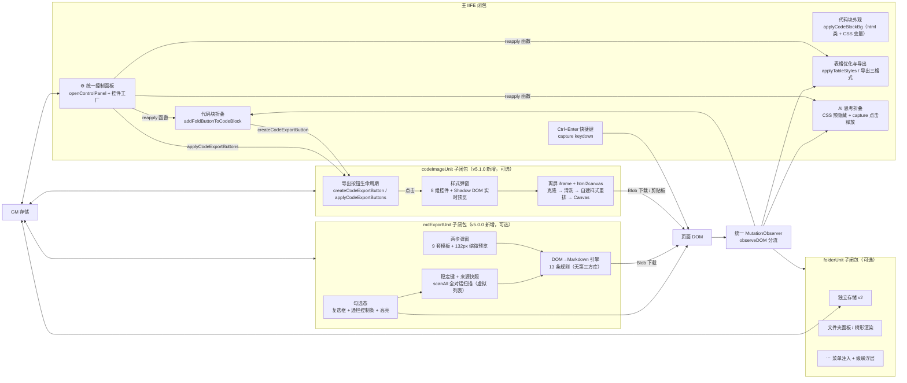
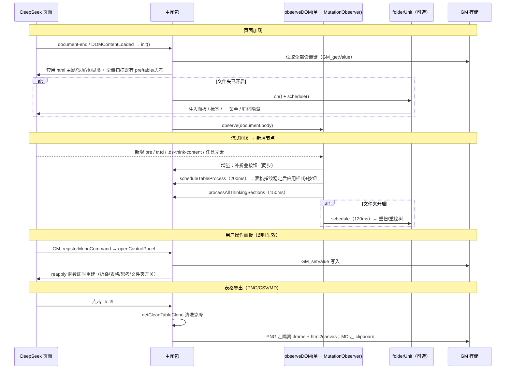
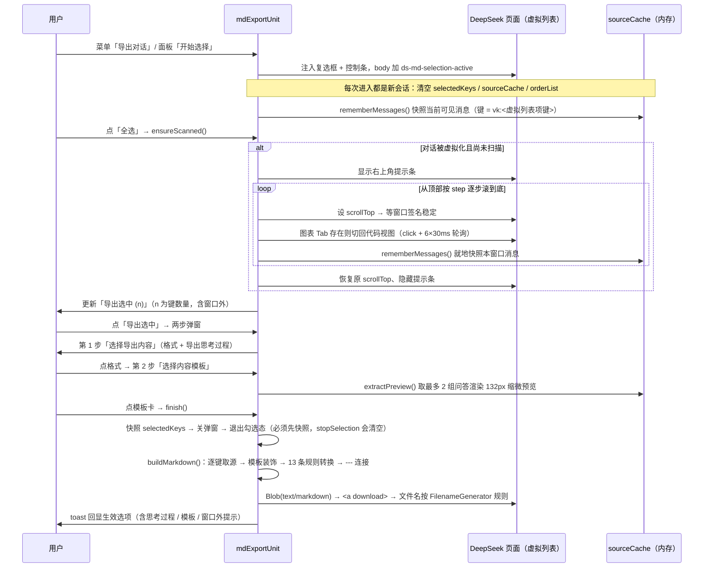
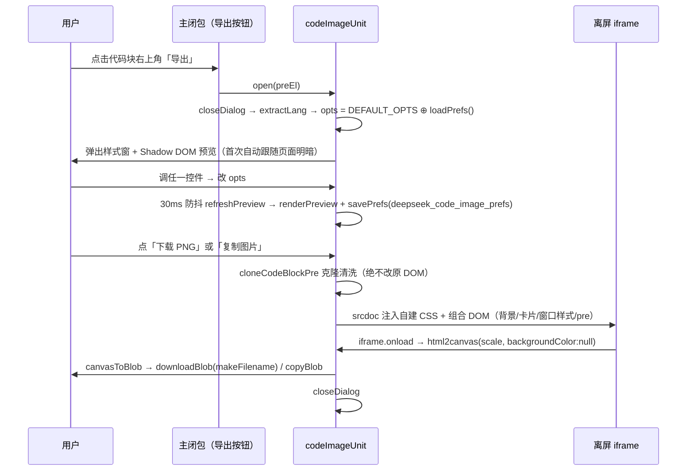

# DeepSeek 功能增强工具箱 — 代码地图（MAP）

> 依据 `deepseektool.user.js`（@version 5.1.1）实际代码整理，描述模块划分、数据流与运行时调度。

## 1. 载体与元信息（头部注释）

| 项 | 值 | 说明 |
| --- | --- | --- |
| 运行载体 | Tampermonkey / ScriptCat userscript | 单 IIFE 主闭包 + `folderUnit` / `mdExportUnit` / `codeImageUnit` 三个可选子闭包 |
| `@match` | `chat.deepseek.com` / `www.deepseek.com` / `deepseek.com` | 仅 DeepSeek Web 注入 |
| `@run-at` | `document-end` | 见第 4 节：`readyState==='loading'` 挂 DOMContentLoaded，否则立即 `init()` |
| `@grant` | `GM_addStyle` / `GM_getValue` / `GM_setValue` / `GM_registerMenuCommand` | 无网络、无跨域 GM_xhr |
| `@require` | `html2canvas@1.4.1` | 表格与代码块的 PNG 导出（启动不加载逻辑依赖） |
| 状态载体 | `GM_getValue`/`GM_setValue`（每次写入即时持久化） | 设置与文件夹数据分离两键 |

## 2. 状态与存储（GM_* 键 → 全局变量镜像）

> 模式：读取时 `let x = GM_getValue(KEY, 默认)` 建内存镜像；面板/开关改动时先写变量 → `GM_setValue` → 调即时重应用函数。

| 存储键 | 变量 | 默认 | 用途 / 面板控件 |
| --- | --- | --- | --- |
| `deepseek_fold_threshold` | `foldThreshold` | 20 | 代码块自动折叠阈值（0 禁用） |
| `deepseek_fold_preview_lines` | `previewLines` / `enablePreviewLines` | 0 | 折叠后保留预览行数 |
| `deepseek_table_buttons_enabled` | `tableButtonsEnabled` | true | 是否注入表格导出按钮 |
| `deepseek_table_buttons_always` | `tableButtonsAlways` | false | 导出按钮恒显（`html.ds-export-always`） |
| `deepseek_auto_collapse_thinking` | `autoCollapseThinking` | true | AI「已思考」自动折叠总开关 |
| `deepseek_simulate_click_thinking` | `simulateClickThinking` | true | 模拟点击 vs CSS 直接折叠 |
| `deepseek_table_theme_mode` | `tableThemeMode` | 'auto' | 表格配色：auto / dual |
| `deepseek_table_width_mode` | `tableWidthMode` | 'equal' | 列宽：equal / auto / equal-minwidth |
| `deepseek_wide_screen` | `wideScreen` | false | 宽屏模式（`--message-list-max-width:1000px`） |
| `deepseek_ctrl_enter` | `ctrlEnterEnabled` | false | Ctrl+Enter 发送快捷键 |
| `deepseek_folder_manager_enabled` | `folderManagerEnabled` | false | 对话文件夹总开关（opt-in） |
| `deepseek_folder_manager_data_v2` | `data`（folderUnit 内） | `{folders:[],links:{},expanded:{},collapsed:false}` | 文件夹/归属/树展开态/面板折叠态（独立键） |
| `deepseek_pin_group_collapsible` | `pinGroupCollapsible` | false | 原生「置顶」分组**折叠能力**开关（opt-in 子开关，依赖文件夹总开关） |
| `deepseek_pin_group_collapsed` | `pinGroupCollapsed`（folderUnit 内） | false | 原生「置顶」分组**折叠态**（仅能力开关开启时生效/持久化） |
| `deepseek_code_bg_enhance` | `codeBgEnhance` | true | 代码块背景加深总开关（`html.ds-code-bg`） |
| `deepseek_code_bg_level` | `codeBgLevel` | 'light' | 加深强度档位：light / medium / strong（`ds-code-bg-1/2/3`） |
| `deepseek_table_export_rounded` | `tableExportRounded` | true | PNG 导出表格四角圆角（`destination-in` 把四角裁成透明；关则直角矩形） |
| `deepseek_md_export_enabled` | `mdExportEnabled` | true | 对话导出为 Markdown 总开关（opt-in 关闭；关闭则菜单命令与面板入口都不可用） |
| `deepseek_md_export_prefs` | 无（JSON 字符串） | `''` | 弹窗「记住我的选择」落库：`{includeReasoning, templateId, remember}`；**唯一**的选项来源，不回落读旧设置键 |
| `deepseek_md_export_append_date` | `mdExportAppendDate` | true | 导出文件名附加 `-YYYY-MM-DD-HH-mm`（避免同名覆盖） |
| `deepseek_code_export_enabled` | `codeExportEnabled` | true | 代码块「导出为图片」按钮总开关（关闭则移除全部导出按钮） |
| `deepseek_code_image_prefs` | `codeImagePrefs` | null | 代码块导图样式记忆（JSON：背景 / 窗口样式 / 代码底色 / 内边距 / 字号 / 行高 / 导出倍率 / 投影 / 行号） |

## 3. 模块总览

```mermaid
flowchart LR
    subgraph Main["主 IIFE 闭包"]
        Panel["⚙️ 统一控制面板<br/>openControlPanel + 控件工厂"]
        Fold["代码块折叠<br/>addFoldButtonToCodeBlock"]
        CodeBg["代码块外观<br/>applyCodeBlockBg（html 类 + CSS 变量）"]
        Table["表格优化与导出<br/>applyTableStyles / 导出三格式"]
        Think["AI 思考折叠<br/>CSS 预隐藏 + capture 点击释放"]
        Keys["Ctrl+Enter 快捷键<br/>capture keydown"]
    end
    subgraph Folder["folderUnit 子闭包（可选）"]
        FData["独立存储 v2"]
        FPanel["文件夹面板 / 树形渲染"]
        FMenu["⋯ 菜单注入 + 级联浮层"]
    end
    subgraph MdExport["mdExportUnit 子闭包（v5.0.0 新增，可选）"]
        MScan["稳定键 + 来源快照<br/>scanAll 全对话扫描（虚拟列表）"]
        MDialog["两步弹窗<br/>9 套模板 + 132px 缩微预览"]
        MConv["DOM→Markdown 引擎<br/>13 条规则（无第三方库）"]
        MFlow["勾选态<br/>复选框 + 通栏控制条 + 高亮"]
    end
    subgraph CodeImg["codeImageUnit 子闭包（v5.1.0 新增，可选）"]
        CIBtn["导出按钮生命周期<br/>createCodeExportButton / applyCodeExportButtons"]
        CIDialog["样式弹窗<br/>8 组控件 + Shadow DOM 实时预览"]
        CIRender["离屏 iframe + html2canvas<br/>克隆 → 清洗 → 自建样式重排 → Canvas"]
    end
    DOM["页面 DOM"] --> Observer["统一 MutationObserver<br/>observeDOM 分流"]
    Observer --> Fold
    Observer --> Table
    Observer --> Think
    Observer --> Folder
    GM["GM 存储"] <--> Panel
    GM <--> FData
    GM <--> MdExport
    GM <--> CodeImg
    Panel -->|"reapply 函数"| Fold & Table & Think
    Panel -->|"applyCodeExportButtons"| CIBtn
    Keys --> DOM
    MFlow --> MScan --> MConv
    MDialog --> MConv
    MFlow --> DOM
    MConv -->|"Blob 下载"| DOM
    Fold -->|"createCodeExportButton"| CIBtn
    CIBtn -->|"点击"| CIDialog
    CIDialog --> CIRender
    CIRender -->|"Blob 下载 / 剪贴板"| DOM
```

## 4. 初始化与统一 DOM 监听

### 4.1 `init()` 执行序列（幂等，仅一次）

1. 套用静态开关：`applyTableThemeClass` / `applyWideScreen` / `setTableButtonsAlways` / `applyCodeBlockBg`（写 `html` 类）。
2. 代码块：`cleanupLegacyWrappers()`（清旧 wrapper）→ `deduplicateButtons()` → `processAllExistingCodeBlocks()` 全量补按钮（含「导出 → 折叠」次序归一）。
3. 表格：`processAllTables()` 全量处理既有表格。
4. 思考：若开启 → `setupThinkContentHiding()`（注入预隐藏 style + 注册 capture click）+ `processAllThinkingSections()`。
5. 文件夹：若开启 → `folderUnit.on()` + `folderUnit.schedule()`（不等首轮 DOM 变化）。
6. `observeDOM()`：注册 body 级 MutationObserver。
7. `resize` 事件 → 100ms 节流 `processAllTables()`（配合表格 fixed 布局的视口宽联动）。

### 4.2 单一 MutationObserver 的分流（`observeDOM`）

对每次 `childList` mutation 的 `addedNodes` 做四路标记，互不串扰、增量处理：

| 信号 | 判定（matches/querySelector） | 处理 | 节流 / 防抖 |
| --- | --- | --- | --- |
| 代码块 | 新增 `pre` / 含 `pre` | 逐 `pre` `addFoldButtonToCodeBlock`（`data-fold-processed` 幂等） | 同步 |
| 表格 | 新增 `table,tbody,thead,tfoot,tr,td,th,.ds-markdown` | `scheduleTableProcess()` → `processAllTables` | 200ms 防抖 |
| 思考 | 新增 `.ds-think-content`（排除 `pre,.md-code-block` 内） | `processAllThinkingSections` | 150ms 延时 |
| 文件夹 | `folderManagerEnabled` 时任意 ELEMENT 新增（宽触发） | `folderUnit.schedule()` | 120ms 节流 |

防自循环：新增节点增量处理 + `data-*` 幂等标记；面板/标签自身的插入不会产生新的 childList 风暴（folder 注释：面板插入只多触发一次自稳 tick）。

## 5. 模块内部流程

### 5.1 代码块折叠

- **定位按钮容器** `findButtonContainer`：优先 `.code-info-button-text` → 兼容 `.ds-text-button` → 哈希容器兜底（选择器全面加固，不依赖哈希）。
- **自动折叠**：`foldThreshold>0 && 行数>阈值`。预览模式（`previewLines>0`）用 `maxHeight` 截断 + `.ds-fold-preview::after " ..."`；否则 `display:none`。
- **展开恢复**：记录 `origDisplay/origMaxHeight/origOverflow`，用户手动展开后不再被后续加载重置（`expandBlock`）。
- **重应用**：改阈值/预览行 → `reapplyFoldToAllCodeBlocks` 清标记重建按钮。

### 5.2 代码块外观（背景加深）

- **驱动方式**：`applyCodeBlockBg(on, level)` 只切 `html` 上的两个类——总开关 `ds-code-bg` + 强度档位 `ds-code-bg-1/2/3`；具体色值由 CSS 变量 `--ds-code-bg` / `--ds-code-bg-line` 承载（轻 `#f3f4f6`/`#e5e8ec`、中 `#eef1f5`/`#dde3e9`、强 `#e9edf2`/`#d8dfe7`）。纯样式模块，**无 MutationObserver 参与、无需重扫 DOM**。
- **作用范围**：`.md-code-block` 与其内 `.md-code-block-banner-wrap` / `.md-code-block-banner` 统一上底色，banner 另加 `1px` 底分隔线（消除官网「白顶条 + 灰代码体」割裂）。
- **主题隔离**：所有规则以 `body:not(.dark)` 限定，深色主题完全交还官网；分隔线仅使块高 +1px，无布局位移。

### 5.3 表格优化与导出

- **样式应用 `applyTableStyles`**：`maxWidth` 取自 `.ds-virtual-list-visible-items.clientWidth`；按 `tableWidthMode` 三策略（均分 / 内容比例自适应 / 均分+80px 下限，超出自动回落自适应并 Toast）；配色由 `html.ds-table-auto`（半透明叠加）或 `html.ds-table-dual`（浅/深双规则）类驱动；`overflow-wrap:anywhere`；仅改直接包裹的 `.ds-scroll-area`；完成后 `opacity:1` 淡入（消除闪烁）。
- **指纹稳定状态机**：`_tableFingerprints`（WeakMap）记录 `rows:cells`。首见立即应用；内容变化后重新进入稳定计数——连续 2 次指纹一致或 5s 超时后应用并 `done`，不再重复 reflow。
- **导出**：三格式共用 `getCleanTableClone`（深拷贝 + 清 fixed/宽度等内联样式 + 摘导出按钮/脚本标记）：
  - 📸 PNG：隔离 iframe（srcdoc + `collectTableStyles` 收集页面样式与兜底配色）→ `html2canvas scale:3` → blob 下载；**纸底**由 `getExportCanvasBg()` 跟随页面深浅（沿祖先链取首个不透明背景色，兜底 深 `#1a1a22`/浅 `#ffffff`）；**文字色/链接/行内代码**由 `collectTableStyles(sourceTable)` 抄取页面表格内 `th`/`td`（color）、`a`（color + `text-decoration-line`）、`code`（color + `background-color`）的实际计算样式写进兜底规则（iframe 无 `.ds-markdown` 祖先、不继承页面 color，不显式取值会在深色纸底上落回黑字 / 默认 #0000EE 蓝链接 / 灰底 code）；**圆角**受开关 `tableExportRounded` 控制 —— `applyRoundedCorners` 用 `destination-in` 把四角裁成透明（半径按 `canvas宽/元素CSS宽` 换算并 clamp，且**须先 `setTransform(1,0,0,1,0,0)` 重置** html2canvas 残留的变换矩阵，否则蒙版错位、裁剪失效）；
  - 📄 CSV：UTF-8 BOM + 引号/逗号/换行转义；
  - 📝 MD：复制到剪贴板；保留 `code`/`**`/`*` 行内语法、`|` 转义、` ` 折为空格。
- **显隐**：`.table-internal-buttons` 默认 hover 显示；`html.ds-export-always`（`setTableButtonsAlways`）强制常显。

### 5.4 AI 思考过程自动折叠

- **预隐藏（零布局偏移）**：注入 `#ds-think-hide`：`.ds-think-content{display:none!important}`；document **capture 阶段**监听折叠区点击 → 移除该 style → 官方正常创建可视内容。
- **折叠执行** `processAllThinkingSections`：基于稳定的 `.ds-think-content` 类名 + 标题「已思考」向上找 wrapper；`simulateClickThinking` 开 → 模拟点击箭头（保持原生交互），关 → CSS 直接隐藏；`data-thinking-collapsed` / `dsScriptCollapsed` 防重。

### 5.5 对话文件夹管理（folderUnit 子闭包）

- **总开关**：控制面板开关 → `folderEnabledChanged(on|off)` → `folderUnit.on()/off()`；切换后若面板处于打开态会关闭重开，以刷新子开关置灰态。
- **子开关**：`pinGroupCollapsible`（存储键 `deepseek_pin_group_collapsible`，默认 false）控制「置顶分组可折叠」能力；设置面板该行在总开关未开时置灰不可点。切换即时生效 → `folderUnit.setPinCollapsible(bool)`：开启则 `bindPinClick()` + `applyPinCollapse()`，关闭则 `resetPinCollapseUi()`。
- **on**：注入主题 CSS 变量（浅/深随 `body.dark`）→ **若子开关开启**则绑定「置顶」折叠点击（`bindPinClick`）→ `ensurePanel`（面板插入「置顶」**分组容器**之后、整体随原生会话历史滚动；无置顶分组时兜底插列表最顶并临时补 22px 让开悬浮「多选」按钮）→ `renderFolders` + `refreshTags` + `injectMenus` + 归档隐藏已收会话（`syncArchiveVisibility`，置顶分组内的行豁免）。
- **面板锚点稳态判据（v4.9.2 修正）**：`ensurePanel` 的早退条件是**直接核对锚点**——有「置顶」分组时要求 `panel.previousElementSibling === pg`，无分组时要求 `panel === sc.firstChild`；不满足则走重挂迁移。旧判据「不在 pg 内即稳态」语义过宽，会让早期竞态被兜底挂到最顶的面板**永久卡在错误位置**。重挂逻辑带幂等保护（位置/`paddingTop` 确需变更时才动 DOM），避免无意义 mutation 触发 observer→schedule 自激循环。
- **数据模型**：`{folders, links(sid→fid), expanded, collapsed}`；改动路径 `…→ saveData() → renderFolders()/resyncFolders()`。
- **交互**：面板头点击整体折叠（`collapsed` 隐藏列表与「＋新建」）；树形就地展开；内嵌会话行点击跳官方会话（当前会话高亮，带自绘悬停 tooltip）；每行「移出」。
- **级联浮层**：⋯ 菜单注入「移动到文件夹」→ 悬停开 `#dsFolderPop`（列出文件夹 / ＋新建 / 移出）；**伪悬停门控**——用 `pointermove`/capture click 时间戳（`lastMenuOpenAt`/`lastRealMoveAt`）避免"点 ⋯ 时菜单项正好在指针下"误弹次级菜单；关闭只移除自己浮层，不藏官方 `.ds-floating-container`。
- **「置顶」分组折叠**（受子开关 `pinGroupCollapsible` 控制）：`findPinnedGroup` 定位原生「置顶」分组容器（缓存 `pinnedGroupEl`，`isConnected` 失效即重算；判据 = 容器内含 innerText 为「置顶」的 sticky 头）→ `findPinHeader` 取其中标题 → `applyPinCollapse` 加稳定类 `ds-pin-head` / 折叠类 `dsPinCollapsed`，并隐藏容器内除标题外的兄弟（被藏节点标 `data-ds-pin-hidden`，展开时只还原自己藏过的）；点击走 document 级捕获事件委托（不依赖官网 hash 类名），折叠态每轮 `schedule` 重放（抗 React 重建，仅子开关开启时）；状态存 `deepseek_pin_group_collapsed`，多选态下不响应。箭头经伪元素 `mask` 绘制（基础图形 = 下向 chevron `M3.5 6 8 10.5 12.5 6`），折叠态加 `dsPinCollapsed` 时 `rotate(-90deg)` 转为朝右——与「文件夹」头 `dsHeadCaret` 的图形、旋转角完全一致，语义统一为**展开 = ⌄、折叠 = ›**。
- **多选互斥**：`syncSelectModeLock` 检测列表根内 `.ds-checkbox`（普通态 0 / 原生多选态 >0，为多选专属标记）→ 面板加 `dsSelectModeHidden`（`display:none`）整区隐藏，退出多选自动恢复。
- **off（整体清理）**：`resetPinCollapseUi`（**无条件**解绑折叠点击 + 还原被折叠隐藏的原生节点与注入类名）、还原被归档隐藏的原生会话行、移除面板/标签/注入菜单项/临时样式/CSS 变量/自绘 tooltip；数据保留，再次开启可恢复。
- **路由**：URL 会话变化才重绘树（防 observer 自激循环）；导航切换后 `folderUnit.schedule()` 由外层驱动。

### 5.6 发送快捷键（Ctrl+Enter）

`document` capture `keydown`（`ctrlEnterEnabled` && 目标为 `TEXTAREA` && Enter）：

- `Ctrl/Cmd+Enter` → `preventDefault+stopPropagation` 后派发**不带修饰**的 Enter（让官方按 Enter 发送语义处理），`_supressNextEnter` 吞掉自身派发的一次；
- 纯 `Enter`（无修饰、非 Shift）→ `stopPropagation`（改为换行、不再发送）；
- `Shift+Enter` → 不拦截（保持原生换行）。

### 5.7 对话导出为 Markdown（`mdExportUnit` 子闭包，v5.0.0 新增）

自包含闭包，**不引入任何第三方 Markdown 库**。总链路：**勾选 → 两步弹窗 → 内容模板 → 转换 → 下载**。

**入口**：油猴菜单「导出对话」→ `beginExportFlow()`；或面板「📄 对话导出 → 开始选择」（先关面板再进勾选态）。

#### 5.7.1 稳定键与来源快照（长对话能导全的根基）

DeepSeek 用虚拟列表渲染，**只渲染可视窗口内的消息，滚过去即被 React 卸载**。因此：

- **稳定键** `stableKeyOf(el)`：优先 `closest('[data-virtual-list-item-key]')` 的属性值 → `vk:<n>`；回退 `ix:<DOM 序号>`。
- **来源快照** `sourceCache: Map<key, {key, role, src}>`，`src` 存**原始素材**
  （assistant → `{reasoningHTML, answerHTML}`；user → `{questionHTML}`），**与导出选项解耦**——
  「导出思考过程」等开关在导出时才生效，不污染快照。
- `rememberMessages()` 每次都重取**当前可见**消息（保证流式内容最新），已滚过的保留旧快照。

#### 5.7.2 全对话扫描 `scanAll()`

1. `findScrollContainer()`：**从 `.ds-virtual-list-items` 沿祖先链向上**找第一个
   `overflowY ∈ {auto, scroll}` 且 `scrollHeight > clientHeight + 4` 的元素；找不到回退 `document.scrollingElement`。
   ⚠ 不可全页扫 `.ds-scroll-area` 取首个可滚动者——实测该类元素 30+ 个，首个命中的装饰容器
   `.ds-scroll-area__gutters` **不含任何消息**，会导致扫描静默失败。
2. 记下原 `scrollTop`；`orderList` 清空重建；显示右上角提示条（`.ds-md-notice`）；
3. 从 0 起以 `step = max(240, ⌊0.45 × clientHeight⌋)` 逐步下滚，每步 `captureAt()`：
   设 `scrollTop` → `waitWindowStable()`（连续两次「窗口签名」一致，上限 24 次 rAF）→
   必要时 `ensureCodeView()`（图表 Tab 切回代码视图）→ `rememberMessages()`；
4. 到底后再冲 3 次底部；把缓存里未入顺序表的键补到末尾；
5. `finally`：恢复原 `scrollTop` → 再等稳定 → 刷新可见消息 → 隐藏提示条。

触发时机：点「全选 / 全选提问 / 全选AI回答」时 `ensureScanned()`；点「导出选中」前再兜一次。
非虚拟化对话（无 `.ds-virtual-list-items`）直接标记完成，不做滚动。

#### 5.7.3 勾选态

- 控制条 `.ds-md-controls`：**通栏贴底 + 毛玻璃**（`backdrop-filter: saturate(180%) blur(4px)` + `border-top`），
  按钮为「全选 / 全选提问 / 全选AI回答 / 导出选中 (n) / 取消」；提示文字绝对定位在「取消」**右侧**
  （未选中红字、有选中灰字）。
- 选择状态存 `selectedKeys: Set<string>`（**键**，不是元素引用）→ 滚出视野不丢选中。
- 复选框 `.ds-md-checkbox`（20×20 / 2px 边框 / 圆角 8）注入到 `.ds-message`；挂载前若
  `getComputedStyle(el).position === 'static'` 先补 `relative`（否则 absolute 复选框会飞到页面左上角）。
- 高亮目标：用户消息 → `resolveUserRoot()`（`.ds-collapsible-text`）；AI 消息 → `.ds-message` 自身。
- 扫描期间 `body.ds-md-selection-scanning` 隐藏全部复选框，控制条按钮禁用。
- `Esc` 退出（捕获阶段；模态框打开时让位给模态框）。

#### 5.7.4 两步弹窗

- 第 1 步「选择导出内容」：格式（Markdown）+「导出思考过程」（自绘 44×24 胶囊，默认开）；
- 第 2 步「选择内容模板」：模板卡两列网格，上半为 **132px 缩微预览**（底部 28px 渐隐），
  下半为名称 + 描述；页面切换时分别加 `step-slide-in` / `step-slide-back` 动画。
- 模板清单由选中内容决定：`hasUser && !hasAi` → 问题清单类，否则问答类；两者都前置「原样输出」。
- 「记住我的选择」仅在**第 2 步**出现；勾选后落库到 `deepseek_md_export_prefs`，下次**预填**（不跳过步骤）。

#### 5.7.5 内容模板装饰

9 套装饰器，产出的仍是**语义 DOM**（`h1/p/blockquote/strong`），直接喂给转换引擎：

| 模板 | 用户消息侧 | AI 消息侧 |
|---|---|---|
| `plain` | 不动 | 不动 |
| `conversation` | 折叠为单段 + `**提问：**` | `**回答：**` |
| `structured` | `# n、<摘要≤15字>`；超长补「问题详情：」(灰) | `**回答（Answer）：**` + 标题降级 |
| `knowledgeDoc` | `# n. <摘要≤60字>` | 标题降级 |
| `rolePlay` | 折叠 + `**我说：**` | `**DeepSeek说：**` |
| `qStructured` | `# n、摘要` + 问题详情 | — |
| `qOutline` | `## n. 摘要` | — |
| `qCards` | `# Qn：` + `> 问题` | — |
| `qPlainText` | `n. 全文` | — |

要点：① 取问题文本分两个函数——`fullText()` **保留换行**（供 ` ` 分节），`oneLine()` 压空白
（供摘要与长度判断）；② 标题降级**仅当答案体内存在 `<h1>`** 时才把所有 h1–h5 各降一级。

#### 5.7.6 转换引擎（13 条规则，顺序敏感）

`code-block → inline-code → math → table → heading → hr → blockquote → list → paragraph → link → image → strong → emphasis`

- **代码块**：围栏自适应 `max(3, 内容最长反引号串 + 1)`，语言写在开围栏同一行；
- **行内代码**：前后含空格时补空格包裹（CommonMark 规定）；
- **公式**：`KaTeX` 的 `annotation[encoding="application/x-tex"]` → `data-ds-md-tex` → 行内 `$…$` / 块级 `$$\n…\n$$`；
- **表格**：表头取首个含 `th` 的行，按最大列数补空对齐，单元格内 `|` 转义、换行折为空格；
- **列表**：每层缩进 2 空格，续行缩进 = 缩进 + marker 长度 + 1；`li` 首行若是嵌套标记则本层 marker 独占一行；
- **文本节点**：**含换行且 trim 后为空则丢弃**（否则 HTML 排版换行会污染输出）；
- **剪枝**：`wrapFromSource()` 只保留「思考体 + 答案体」，其余装饰层一律丢弃——比逐个枚举待删选择器稳健得多。

`normalizeContent()` 六步（各步独立 try/catch）：表格壳脱壳 → 数学 → 代码块 → 列表 → 纯文本 div→`
` → 噪音清理
（引用角标按**样式特征** `position:absolute` / `opacity:0` 判定，须先于删 svg 执行）。

#### 5.7.7 下载与文件名

`buildFilename('md')` 的规则：
兜底名 `DeepSeek对话` → 追加 `-YYYY-MM-DD-HH-mm`（`mdExportAppendDate`，默认开）→
`\s+`→`_`、`[<>:"/\\|?*]`→`_` → 截断 50 字。Blob 类型 `text/markdown;charset=utf-8`（**不写 BOM**）。

### 5.8 代码块导出为图片（`codeImageUnit` 子闭包，v5.1.0 新增）

自包含闭包，**零新增依赖 / 零新增权限**，且**不改动页面原 DOM**。
总链路：**克隆代码块 → 清洗 → 离屏自建样式重排 → `html2canvas` 渲染 → Blob**（沿用表格导出的「克隆 + 隔离」铁律）。

**按钮生命周期**
- `createCodeExportButton(preEl)`：造按钮（`ICON_EXPORT_IMAGE` + 「导出」文字），点击 `codeImageUnit.open(preEl)`；
- `applyCodeExportButtons(on)`：开关切换时遍历全部 `pre` 按需增删导出按钮（**只动导出按钮，不碰折叠按钮**）；
- `addFoldButtonToCodeBlock` 内两类按钮**各自判重**（旧写法只判折叠按钮即 `return`，会漏掉导出按钮）；`deduplicateButtons` 与 `reapplyFoldToAllCodeBlocks` 均对 `['.ds-fold-btn', '.ds-code-export-btn']` **成对处理**——只删折叠按钮会让导出按钮残留、且 `append` 到末尾造成两按钮顺序错乱；
- **按钮次序约定「导出 → 折叠」**（导出是主动作）：增量路径**先建导出、后建折叠**；`ensureButtonOrder()` 做幂等归一（顺序已正确时不产生任何 DOM 变更），并由 `processAllExistingCodeBlocks()` 对已处理节点复跑，兜住脚本热更新后残留的旧顺序。

**克隆清洗 `cloneCodeBlockPre(block)`**
`cloneNode(true)` → 移除整条 `.md-code-block-banner-wrap`（语言标签 + 官方按钮 + 自绘按钮）、`.ds-fold-btn` / `.ds-code-export-btn` / `.table-internal-buttons`，剔除装饰 `<svg>`，清 `data-fold-processed` 与折叠态（`style.maxHeight/overflow/display` + `.ds-fold-preview` + `dataset.orig*`）→ **折叠态代码块也能拿到全文**。以上全部只在副本上操作。

**渲染 `renderToCanvas(preEl, opts)`**
- 组装 DOM：`.ds-shot-root`（背景 = `bgCssOf(opts.bg)` + padding）＞ `.ds-shot-card`（`theme.bg` + 可选投影）＞ 可选 `.ds-shot-bar`（macOS 三点）＞ `.ds-shot-body` ＞ 清洗后的 `<pre>`；
- ⚠️ **`.ds-shot-card` 必须带 `position:relative`**（不是装饰，删了即复现）：`html2canvas@1.4.1` 分层渲染会把「未定位的 `inline-block`」元素的背景归到靠后的绘制分组，卡片底色因此排到子元素背景**之后**，把 macOS 三点整块反盖（实测红点像素 424 → 0，**与代码长短无关**，29 行同样复现）。定位后卡片归入 `positioned` 分组，恢复「先卡片底色、后子元素」的正确顺序，且不改变任何布局与画布尺寸。`audit-code-image.js` §6 已加静态防线守住这一条；
- 把 `buildShotCss(opts, theme)` 与 `dom.outerHTML` 塞进**离屏 `iframe(srcdoc)`**（`left:-99999px`；1400×900），等 `iframe.onload`（兜底 2s 超时）后取 `doc.querySelector('.ds-shot-root')`，交 `html2canvas({ scale, backgroundColor:null, logging:false })`；
- `backgroundColor:null` 让「透明」背景预设真正透明；`finally` 延时移除 iframe。

**配色 `resolveTheme(opts)`**
官网高亮是 Prism `token` **class**（无内联色）→ 染色规则由 `buildShotCss(opts, theme, liveColors)` 生成（`.ds-shot-root .token.<type>{color:…!important}`），**色源两路**：
- `harvestTokenColors(root)`：在**原 DOM** 上按 `.token` 类名读计算色 → 「导出底色 == 页面底色」时优先采用（完全还原官网观感，并自动覆盖官网后续新增的 token 类型）。⚠️ **必须早于 `cloneCodeBlockPre`**：克隆体已脱离文档，`getComputedStyle` 一律取不到值。
- `THEME_LIGHT` / `THEME_DARK` 自建色板（Prism 常见类型：comment / keyword / string / attr-name / attr-value / tag / selector / atrule / function / operator / number / constant / property / punctuation …）→ 底色与页面**不一致**时兜底，防明暗串味。

`opts.theme` 显式给定即用它；为空时随 `body.dark` 判明暗底（首次打开自动跟随页面，之后按记忆的选项）。预览（Shadow DOM）与导出共用同一份 `liveColors`，保证两者同色。

**行号（CSS counter）**
启用时追加 `.ds-shot-root pre{counter-reset:…}` / `pre > span{counter-increment:…}` / `span::before{content:counter(…)}`——Prism 按行分包，导出强制 `white-space:pre`（**不折行**，卡片按最长行自适应宽度），逻辑行 = 视觉行 1:1，行号天然对齐。（注：官网 `pre` 的计算样式实为 `white-space:pre-wrap`，仅因实测最宽行 829px < 内容宽 858px 才未折行。）

**输出**
- `canvasToBlob` → `downloadBlob(blob, makeFilename(lang))`，文件名 `code-<lang|snippet>-YYYYMMDD-HHmmss.png`；
- `canCopyImage()`（`navigator.clipboard.write` + `ClipboardItem`）预检，不满足则「复制图片」按钮禁用；满足则 `copyBlob`。

**弹窗 `openDialog(preEl)`**
- 8 组控件：背景色板（8 套）/ 窗口样式（macOS 三点 · 无框）/ 代码底色（浅 · 深）/ 内边距 / 字号 / 行高（滑杆）/ 导出倍率（1x·2x·3x）/ 其他（投影 + 行号开关）；
- 预览在 **Shadow DOM** 内渲染（`renderPreview` 复用 `buildShotCss` + `buildShotDom`），隔离官网 `.token` 规则；`requestAnimationFrame` 里按容器宽等比 `scale` 并同步 `wrap` 尺寸；
- 任一改动 → 30ms 防抖 `refreshPreview()` → 重渲染预览 + `savePrefs(opts)` 落库 `deepseek_code_image_prefs`；
- `_busy` 防重入（导出中禁用两按钮）；`Esc` / 点遮罩 / 关闭按钮退出，`closeDialog` 清空 shadowRoot。

## 6. 典型运行序列

```mermaid
sequenceDiagram
    participant P as DeepSeek 页面
    participant M as 主闭包
    participant O as observeDOM(单一 MutationObserver)
    participant F as folderUnit（可选）
    participant G as GM 存储

    Note over P,G: 页面加载
    P->>M: document-end / DOMContentLoaded → init()
    M->>G: 读取全部设置键（GM_getValue）
    M->>P: 套用 html 主题/宽屏/恒显类 + 全量扫描既有 pre/table/思考
    alt 文件夹已开启
        M->>F: on() + schedule()
        F->>P: 注入面板 / 标签 / ⋯ 菜单 / 归档隐藏
    end
    M->>O: observe(document.body)

    Note over P,G: 流式回复 → 新增节点
    P-->>O: 新增 pre / tr,td / .ds-think-content / 任意元素
    O->>M: 增量：补折叠按钮（同步）
    O->>M: scheduleTableProcess（200ms）→ 表格指纹稳定后应用样式+按钮
    O->>M: processAllThinkingSections（150ms）
    alt 文件夹开启
        O->>F: schedule（120ms）→ 重扫/重绘树
    end

    Note over P,G: 用户操作面板（即时生效）
    P->>M: GM_registerMenuCommand → openControlPanel
    M->>G: GM_setValue 写入
    M->>P: reapply 函数即时重建（折叠/表格/思考/文件夹开关）

    Note over P,G: 表格导出（PNG/CSV/MD）
    P->>M: 点击 📸/📄/📝
    M->>M: getCleanTableClone 清洗克隆
    M->>G: PNG 走隔离 iframe + html2canvas；MD 走 clipboard
```

### 6.1 对话导出为 Markdown（`mdExportUnit`，v5.0.0）

```mermaid
sequenceDiagram
    participant U as 用户
    participant E as mdExportUnit
    participant P as DeepSeek 页面（虚拟列表）
    participant C as sourceCache（内存）

    U->>E: 菜单「导出对话」/ 面板「开始选择」
    E->>P: 注入复选框 + 控制条，body 加 ds-md-selection-active
    Note over E,C: 每次进入都是新会话：清空 selectedKeys / sourceCache / orderList
    E->>C: rememberMessages() 快照当前可见消息（键 = vk:<虚拟列表项键>）

    U->>E: 点「全选」→ ensureScanned()
    alt 对话被虚拟化且尚未扫描
        E->>P: 显示右上角提示条
        loop 从顶部按 step 逐步滚到底
            E->>P: 设 scrollTop → 等窗口签名稳定
            E->>P: 图表 Tab 存在则切回代码视图（click + 6×30ms 轮询）
            E->>C: rememberMessages() 就地快照本窗口消息
        end
        E->>P: 恢复原 scrollTop、隐藏提示条
    end
    E->>U: 更新「导出选中 (n)」（n 为键数量，含窗口外）

    U->>E: 点「导出选中」→ 两步弹窗
    E->>U: 第 1 步「选择导出内容」（格式 + 导出思考过程）
    U->>E: 点格式 → 第 2 步「选择内容模板」
    E->>C: extractPreview() 取最多 2 组问答渲染 132px 缩微预览
    U->>E: 点模板卡 → finish()
    E->>E: 快照 selectedKeys → 关弹窗 → 退出勾选态（必须先快照，stopSelection 会清空）
    E->>E: buildMarkdown()：逐键取源 → 模板装饰 → 13 条规则转换 → --- 连接
    E->>P: Blob(text/markdown) → <a download> → 文件名按 FilenameGenerator 规则
    E->>U: toast 回显生效选项（含思考过程 / 模板 / 窗口外提示）
```

### 6.2 代码块导出为图片（`codeImageUnit`，v5.1.0）

```mermaid
sequenceDiagram
    participant U as 用户
    participant N as 主闭包（导出按钮）
    participant C as codeImageUnit
    participant I as 离屏 iframe

    U->>N: 点击代码块右上角「导出」
    N->>C: open(preEl)
    C->>C: closeDialog → extractLang → opts = DEFAULT_OPTS ⊕ loadPrefs()
    C->>U: 弹出样式窗 + Shadow DOM 预览（首次自动跟随页面明暗）
    U->>C: 调任一控件 → 改 opts
    C->>C: 30ms 防抖 refreshPreview → renderPreview + savePrefs(deepseek_code_image_prefs)
    U->>C: 点「下载 PNG」或「复制图片」
    C->>C: cloneCodeBlockPre 克隆清洗（绝不改原 DOM）
    C->>I: srcdoc 注入自建 CSS + 组合 DOM（背景/卡片/窗口样式/pre）
    I->>C: iframe.onload → html2canvas(scale, backgroundColor:null)
    C->>U: canvasToBlob → downloadBlob(makeFilename) / copyBlob
    C->>C: closeDialog
```

